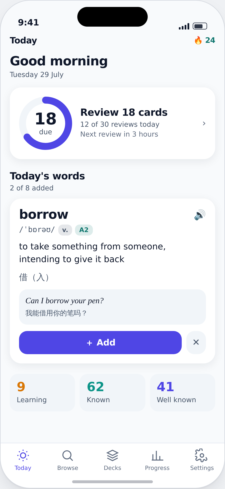
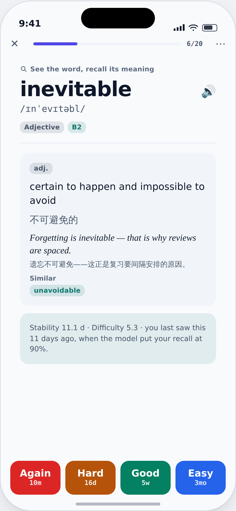
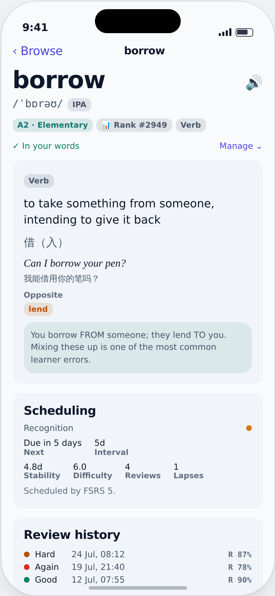

# VocabLoop

An offline-first vocabulary app for iOS, built around a real spaced-repetition
algorithm rather than a fixed interval ladder. English is the launch language;
the schema, content pipeline and UI are language-agnostic, and French and Thai
ship as working starter packs so that abstraction is exercised today rather than
being discovered wrong later.

```
open VocabLoop.xcodeproj        # Xcode 16 or later, iOS 17+
⌘R  to run · ⌘U  to test
```

```bash
xcodebuild test -scheme VocabLoop \
  -destination 'platform=iOS Simulator,name=iPhone 16'
```

> **Sign in with Apple needs one manual step.** The entitlement is not wired into
> the target, so the project builds and tests with a free Apple ID out of the box.
> To turn it on: **VocabLoop target ▸ Signing & Capabilities ▸ + Capability ▸ Sign
> in with Apple** (or point `CODE_SIGN_ENTITLEMENTS` at
> `Config/VocabLoop.entitlements`). Until then the Apple button surfaces a clear
> "capability not enabled" message and every other auth path works normally.

**Want to see the screens without building?**

| | | |
|---|---|---|
|  |  |  |
| Today | Study session | Word detail |

Every screen is in [`docs/screenshots/`](docs/screenshots), light and dark, at 3x. Open
[`docs/screens.html`](docs/screens.html) in a browser for the interactive version — it
follows your system theme and the flashcard's rating buttons run the real scheduler.

These are renders of a faithful mockup, **not screenshots of the running app** — it has
never been compiled (see [CI](#ci)). Colour and geometry come from the same tokens the
app compiles against; only a simulator run can confirm the SwiftUI layout matches.

---

## What it does

**Offline is the default, not a mode.** The whole dictionary, the scheduler,
review logging, streaks, statistics and pronunciation audio all work with the
radio off. Network is used only for optional account sync, which is not wired to
a server in this build.

**Scheduling is FSRS-5.** Every card carries a difficulty, a stability, and a
retrievability derived from a power-law forgetting curve. Because the model
inverts, the user gets a real dial — "review me at 90% retention" — instead of an
opaque ease multiplier. SM-2 ships alongside it as a selectable baseline.

**Daily words** are drawn deterministically per (user, day, language), weighted
toward corpus frequency, so the same day always offers the same words offline and
after a reinstall — and a beginner meets *because* before *ubiquitous*.

**Three card types per word**, each scheduled independently: recognition (word →
meaning), production (meaning → word), and cloze (the word removed from one of its own
example sentences). Cloze masking is language-aware — a token scan for English and
French, a substring match for Thai, which has no spaces between words — and a cloze card
is only created when a blank can genuinely be placed.

**Auth is complete and offline.** Guest is a first-class session that a later
sign-up *adopts* rather than discards. Email/password uses PBKDF2-HMAC-SHA256 at
600k iterations with a per-user salt and constant-time verification; recovery uses
a one-time code, because an offline account has no email to reset through. Sign in
with Apple maps into the same `Session` type. Sessions live in the Keychain. Also
included: password change, profile editing, JSON data export, and in-app account
deletion.

---

## Where things are

| Path | What lives there |
| --- | --- |
| `VocabLoop/Core/SRS` | `Scheduler` protocol, FSRS-5, SM-2, deterministic fuzz. Pure value types, imports only `Foundation` |
| `VocabLoop/Core/Models` | SwiftData schema |
| `VocabLoop/Core/Persistence` | Container, store quarantine, idempotent seed importer |
| `VocabLoop/Core/Services` | Review grading, queue building, daily words, statistics, streaks, TTS, reminders, search, export |
| `VocabLoop/Core/Auth` | `AuthBackend` with local and remote implementations, PBKDF2, Keychain, Apple |
| `VocabLoop/Core/Sync` | Outbox-based sync engine over a REST client (off until a server exists) |
| `VocabLoop/Core/Intents` | Siri and Shortcuts entry points — also what a widget button calls |
| `VocabLoop/DesignSystem` | Colour and type tokens, shared components |
| `VocabLoop/Features` | One folder per screen: SwiftUI views plus `@Observable` view models |
| `VocabLoop/Resources/Seeds` | Content packs as JSON — 146 curated entries across five packs |
| `docs/` | [Screen preview](docs/screens.html) · [Research](docs/RESEARCH.md) · [UI spec](docs/DESIGN.md) · [Architecture](docs/ARCHITECTURE.md) · [Roadmap](docs/ROADMAP.md) · [Adding the widget](docs/WIDGET.md) |

Dependencies point **downward only**: `Core/SRS` knows nothing about SwiftData or
SwiftUI, which is what makes it testable in isolation and replaceable.

The Xcode project uses file-system-synchronized groups, so adding a file needs no
`project.pbxproj` edit — create it in the right folder and build.

---

## Design decisions worth knowing before you change something

Full reasoning is in [`docs/RESEARCH.md`](docs/RESEARCH.md). The short version:

- **`ReviewLog` is append-only and never pruned.** FSRS weights are meant to be
  fitted per learner. We cannot ship an optimiser in v1, but every field one needs
  is captured on every review, so it can be added later and applied retroactively.
  Dropping these rows would make that impossible forever. It is also the
  conflict-free source of truth for sync: review history is genuinely an event
  log, so two devices merge it by union.
- **Interval fuzz is deterministic**, seeded from the card's identity. A card's due
  date must not shift because a schedule was previewed twice, recomputed, or
  replayed during a sync merge.
- **Cards are per (entry, direction)** so recognition and production schedule
  independently — a distinction that matters far more in Thai than in English.
- **Auth never gates studying.** There is no state in which the app shows a
  sign-in wall.
- **Local writes never await the network.** They commit immediately and append to
  a durable outbox.
- **A study day starts at 4am**, not midnight. Someone reviewing at 1am is
  finishing yesterday, and telling them they broke a 200-day streak is how an app
  gets deleted.
- **A streak counts any review, not a completed goal.** Requiring the goal punishes
  exactly the users who are trying on a busy day.

---

## Tests

`VocabLoopTests` covers the layers that carry the risk. The scheduler is pinned to
its *invariants* rather than to magic numbers, so the suite survives future weight
optimisation instead of having to be rewritten by it.

| Suite | What it pins down |
| --- | --- |
| `FSRSTests` | `R(S,S) = 0.9`, monotonicity in rating, retention→interval inversion, difficulty clamping, post-lapse stability ≤ prior, NaN/∞ inputs degrade safely |
| `SM2Tests` | Ease-factor floor, interval ladder, lapse reset, maturity mirroring |
| `FuzzTests` | Determinism per card, bounds, spread widening with interval |
| `ReviewQueueTests` | Overdue-ratio ordering, session caps and deferral reporting, lossless sibling separation |
| `DailyWordTests` | Determinism per (user, day, language), CEFR gating, dismissal is permanent |
| `ReviewServiceTests` | Log completeness, day rollups, undo reconstructed from the log, outbox ordering and backoff |
| `StatsTests` | Due/forecast/maturity buckets, retention excluding introductions |
| `AuthTests` | PBKDF2 round-trip and NFC normalisation, constant-time compare, guest adoption, no account-enumeration oracle, deletion completeness |
| `SeedLoaderTests` | Every bundled pack parses, import is idempotent, user words are never overwritten |
| `ClozeTests` | Token vs substring masking per language, English inflections, authored blanks, 100% coverage of bundled content, enrolment skipping cloze when no sentence can be masked |
| `PaletteContrastTests` | Every colour pairing measured in both appearances against 4.5:1 (3:1 for non-text) |
| `OptimizerTests` | Per-card `deltaT` across interleaved reviews, CSV contract, readiness needing breadth as well as volume, invalid weight vectors rejected |
| `StudyCalendarTests` · `StreakTests` | Day boundaries, DST transitions, streak survival rules |

`VocabLoopUITests` is deliberately small: it checks that a user who never creates
an account reaches a working app and can search the bundled dictionary.

---

## CI

`.github/workflows/ios.yml` runs on every push and pull request:

- **Content packs** (Ubuntu, seconds) — validates every seed pack: JSON, `packName`
  matching its file name, no duplicate headwords after case/diacritic folding, no empty
  definitions, valid CEFR levels. Cheap signal, no macOS minutes spent.
- **Build and test** (macOS) — `xcodebuild test` on an iPhone 16 simulator, with the
  `.xcresult` bundle uploaded as an artifact whether it passes or fails.

**The first run is expected to fail.** The project was written in a Linux container with
no Swift toolchain, so it has never been compiled. That run's error list is the point of
having CI at all.

---

## Not built yet

Stated plainly rather than implied as done:

- **No sync server.** `SyncEngine` and `RemoteAuthBackend` are written and tested
  against the contract documented in their source, and switch on when
  `APIConfiguration.baseURL` is set. Until then the outbox accumulates locally so
  nothing is lost.
- **No per-user FSRS weight optimiser.** Everything either side of the fit is done —
  `OptimizerService` builds the training set in the format the published optimisers read,
  gates on having enough history, and applies a result. The fit itself needs `fsrs-rs` over
  FFI, which would be the project's first non-Apple dependency. Until then Settings ▸ Memory
  algorithm ▸ Tune to my memory exports the log so you can fit it yourself.
- **No widget.** The App Intents are done and drive Siri and Shortcuts today; the Widget
  Extension target is a thirty-second Xcode template plus an App Group — see
  [`docs/WIDGET.md`](docs/WIDGET.md), which has the code. Not hand-written here because
  adding an unverifiable second target to a project that has never compiled is the wrong
  order to do things in.
- **UI copy is English only.** The *learning* language is fully abstracted
  (`LearningLanguage`), which is the stated requirement; localising the app's own
  interface is a separate axis and not done.
- **Learning steps are not editable in the UI.** They are configurable in
  `SchedulerConfig` and shown read-only in Settings.
- **French and Thai packs are 8 entries each.** Real content, deliberately small —
  enough to exercise non-Latin script, RTGS romanisation, tones, gender and
  classifiers in the test suite, not enough to learn from.
- **No app icon artwork.** `AppIcon.appiconset` is an empty placeholder.
